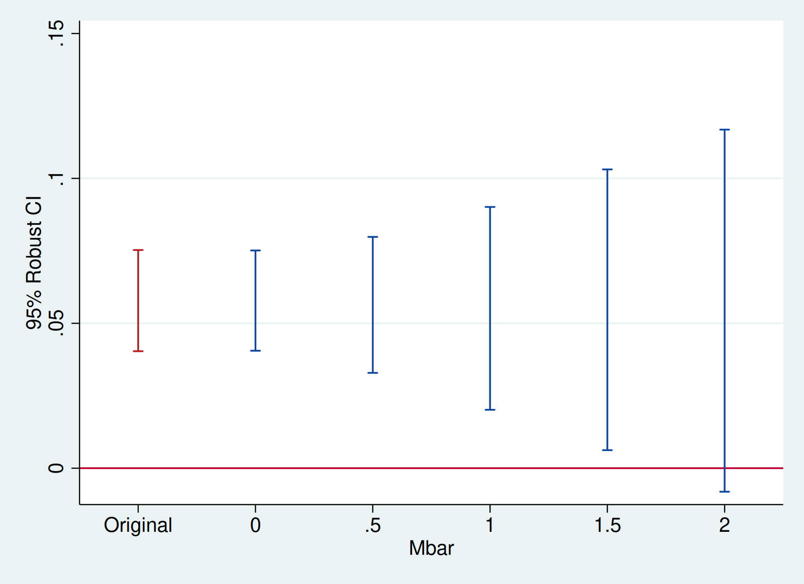
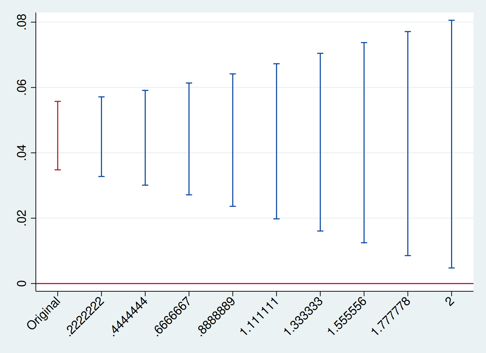

HonestDiD
=========

The HonestDiD package implements the tools for robust inference and
sensitivity analysis for differences-in-differences and event study
designs developed in [Rambachan and Roth (2022)](https://asheshrambachan.github.io/assets/files/hpt-draft.pdf).
This is the Stata version of the [R package of the same name](https://github.com/asheshrambachan/HonestDiD). There is also a [Shiny app](https://ccfang2.shinyapps.io/HonestDiDSenAnlys/) developed by Chengcheng Fang.

`version 1.3.4 27Feb2025` | [Background](#background) | [Installation](#package-installation) | [Examples](#example-usage----medicaid-expansions) | [Acknowledgements](#acknowledgements)

## Background

The robust inference approach in Rambachan and Roth formalizes the
intuition that pre-trends are informative about violations of parallel
trends. They provide a few different ways of formalizing what this
means.

**Bounds on relative magnitudes.** One way of formalizing this idea is
to say that the violations of parallel trends in the post-treatment
period cannot be much bigger than those in the pre-treatment period.
This can be formalized by imposing that the post-treatment violation of
parallel trends is no more than some constant $\bar{M}$ larger than the
maximum violation of parallel trends in the pre-treatment period. The
value of $\bar{M} = 1$, for instance, imposes that the post-treatment
violation of parallel trends is no longer than the worst pre-treatment
violation of parallel trends (between consecutive periods). Likewise,
setting $\bar{M} = 2$ implies that the post-treatment violation of
parallel trends is no more than twice that in the pre-treatment period.

**Smoothness restrictions.** A second way of formalizing this is to say
that the post-treatment violations of parallel trends cannot deviate too
much from a linear extrapolation of the pre-trend. In particular, we can
impose that the slope of the pre-trend can change by no more than *M*
across consecutive periods, as shown in the figure below for an example
with three periods.


Thus, imposing a smoothness restriction with $M = 0$ implies that the
counterfactual difference in trends is exactly linear, whereas larger
values of $M$ allow for more non-linearity.

**Other restrictions**. The Rambachan and Roth framework allows for a
variety of other restrictions on the differences in trends as well.
However, not all these have yet been implemented in this Stata version
of the package. This functionality is planned for a future release.

**Robust confidence intervals**. Given restrictions of the type
described above, Rambachan and Roth provide methods for creating robust
confidence intervals that are guaranteed to include the true parameter
at least 95% of the time when the imposed restrictions on satisfied.
These confidence intervals account for the fact that there is estimation
error both in the treatment effects estimates and our estimates of the
pre-trends.

**Sensitivity analysis**. The approach described above naturally lends
itself to sensitivity analysis. That is, the researcher can report
confidence intervals under different assumptions about how bad the
post-treatment violation of parallel trends can be (e.g., different
values of $\bar{M}$ or $M$.) They can also report the "breakdown value"
of $\bar{M}$ (or $M$) for a particular conclusion---e.g. the largest
value of $\bar{M}$ for which the effect is still significant.

## Package installation

The package may be installed by using `net install` for the latest version:

```stata
local github https://raw.githubusercontent.com
net install honestdid, from(`github'/mcaceresb/stata-honestdid/main) replace
honestdid _plugin_check
```

Version `1.3.0` (`25Jan2024`) of the package is currently available via SSC:

```stata
ssc install honestdid
honestdid _plugin_check
```

## Compiling

`honestdid` uses compiled C code internally; if you receive an error
message saying "Failed to load OSQP/ECOS plugin" then you will need
to compile the plugin in order to use `honestdid`. While we provide
pre-compiled binaries, they may not work on every system. If you are
using OSX or Linux, compiling is relatively straightforward. From a
terminal, run:

```bash
git clone https://github.com/mcaceresb/stata-honestdid
cd stata-honestdid
bash src/compile.sh
```

You're required to have `make`, `cmake`, and `clang` (OSX) or `gcc`
(Linux) installed; all three should be readily available on any OSX or
Linux system. On Windows:

1. Install [Cygwin](https://www.cygwin.com).
2. Install `binutils`, `make`, `cmake`, `gcc-core`, `gcc-g++`, `mingw64-x86_64-gcc-core`, `mingw64-x86_64-gcc-g++`, `mingw64-x86_64-dlfcn`
3. Open the Cygwin terminal and run

```bash
git clone https://github.com/mcaceresb/stata-honestdid
cd stata-honestdid
sed -i 's/\r$//' src/compile.sh
bash src/compile.sh
```

Once the plugin is compiled, from a Stata session run

```stata
cd /path/to/stata-honestdid/
do src/install.do
```

(On Windows, the repo will likely be somewhere in `C:\cygwin64\home\..`,
depending on where you installed Cygwin.) If compiling the plugin yourself does
not fix it, please open an issue.

## Example usage -- Medicaid expansions

As an illustration of the package, we will examine the effects of
Medicaid expansions on insurance coverage using publicly-available data
derived from the ACS. We first load the data and packages relevant for
the analysis.

```stata
* Install here coefplot, ftools, reghdfe, plot scheme
local github https://raw.githubusercontent.com
ssc install coefplot,      replace
ssc install ftools,        replace
ssc install reghdfe,       replace
net install scheme-modern, replace from(`github'/mdroste/stata-scheme-modern/master)
set scheme modern

* Load data
local mixtape https://raw.githubusercontent.com/Mixtape-Sessions
use `mixtape'/Advanced-DID/main/Exercises/Data/ehec_data.dta, clear
l in 1/5
```

```
     +--------------------------------------------+
     |  stfips   year       dins   yexp2        W |
     |--------------------------------------------|
  1. | alabama   2008   .6814122       .   613156 |
  2. | alabama   2009   .6580621       .   613156 |
  3. | alabama   2010   .6313651       .   613156 |
  4. | alabama   2011   .6563886       .   613156 |
  5. | alabama   2012   .6708115       .   613156 |
     +--------------------------------------------+
```

The data is a state-level panel with information on health insurance
coverage and Medicaid expansion. The variable `dins` shows the share of
low-income childless adults with health insurance in the state. The
variable `yexp2` gives the year that a state expanded Medicaid coverage
under the Affordable Care Act, and is missing if the state never
expanded.

### Estimate the baseline DiD

For simplicity, we will first focus on assessing sensitivity to
violations of parallel trends in a non-staggered DiD (see below
regarding methods for staggered timing). We therefore restrict the
sample to the years 2015 and earlier, and drop the small number of
states who are first treated in 2015. We are now left with a panel
dataset where some units are first treated in 2014 and the remaining
units are not treated during the sample period. We can then estimate the
effects of Medicaid expansion using a canonical two-way fixed effects
event-study specification,

$$
Y_{it} = \alpha_i + \lambda_t + \sum_{s \ne 2013} 1[s = t] \times D_i \times \beta_s + u_{it}
$$

where $D$ is 1 if a unit is first treated in 2014 and 0 otherwise.


```stata
* Keep years before 2016. Drop the 2016 cohort
keep if (year < 2016) & (missing(yexp2) | (yexp2 != 2015))

* Create a treatment dummy
gen byte D = (yexp2 == 2014)
gen `:type year' Dyear = cond(D, year, 2013)

* Run the TWFE spec
reghdfe dins b2013.Dyear, absorb(stfips year) cluster(stfips) noconstant

local plotopts ytitle("Estimate and 95% Conf. Int.") title("Effect on dins")
coefplot, vertical yline(0) ciopts(recast(rcap)) xlabel(,angle(45)) `plotopts'
```

<!-- -->


## Sensitivity analysis using relative magnitudes restrictions

We are now ready to apply the HonestDiD package to do sensitivity
analysis. Suppose we’re interested in assessing the sensitivity of
the estimate for 2014, the first year after treatment.  The `pre()` and
`post()` options specify the indices of the coefficients corresponding
with pre-treatment and post-treatment event-study coefficients
(excluding the one for 2013, which is normalized to zero); Stata's
`numlist` notation is allowed. Finally, `mvec()` specifies the values of
$\bar{M}$.

```stata
honestdid, pre(1/5) post(7/8) mvec(0.5(0.5)2)
```

```
|    M    |   lb   |   ub   |
| ------- | ------ | ------ |
|       . |  0.029 |  0.064 | (Original)
|  0.5000 |  0.024 |  0.067 |
|  1.0000 |  0.017 |  0.072 |
|  1.5000 |  0.008 |  0.080 |
|  2.0000 | -0.001 |  0.088 |
(method = C-LF, Delta = DeltaRM, alpha = 0.050)
```

First, note in this case the coefficients are ordered and mostly
contiguous, so `pre(1/5)` refers to entries 1 through 5 and `post(7/8)`
refers to entries 7 through 8. If the coefficients happen to be in
different orders, positions, or if there are controls included in the
regression, the user can pass an arbitrary list of indices to `pre()`
and `post()`. For instance,

```stata
honestdid, pre(1 2 3 4 5) post(7 8) mvec(0.5(0.5)2)
```

gives the same result. Second, note the coefficient vector returned by
`reghdfe` includes an entry for `2013`, the reference period, which was
omitted from the regression but is included in the vector of estimates.
It is possible to tell `honestdid` to ignore omitted regressors when
specifying variable indices; this can be specially useful when there
are many such covariates. For example,

```stata
reghdfe dins b2013.year##D, absorb(stfips year) cluster(stfips) noconstant
matrix list e(b)
honestdid, pre(1/5) post(6/7) mvec(0.5(0.5)2) omit
```

gives the same results (i.e. the coefficient vector contains several
zeros from omitted regressors, but with the `omit` option we only needed
to specify the indices for the included regressors). It's important that
here the post-period indices are 6 and 7, since the reference period is
no longer included. Further, the `omit` option does **not** exclude
zeros; rather, it excludes vector entries indicated to have been omitted
from a regression (based on the column names of the coefficient vector;
see `help _ms_omit_info` for more).

Finally, in the special case where there are no controls or where the
user has gathered the pre- and post-treatment coefficients into a custom
vector, it is also possible to specify just the number of pre-treatment
periods via `numpre()` and `honestdid` will automatically assume the
first `numpre` entries are pre-treatment coefficients and the rest are
post-treatment coefficients.

```stata
reghdfe dins b2013.Dyear, absorb(stfips year) cluster(stfips) noconstant
honestdid, numpre(5) mvec(0.5(0.5)2) omit

mata index = 1..5, 7..8
mata st_matrix("b", st_matrix("e(b)")[index])
mata st_matrix("V", st_matrix("e(V)")[index, index])
matrix list b
matrix list V
honestdid, numpre(5) mvec(0.5(0.5)2)
```

In all cases, the output of the `honestdid` command shows a robust
confidence interval for different values of $\bar{M}$. We see that the
"breakdown value" for a significant effect is $\bar{M} \approx 2$,
meaning that the significant result is robust to allowing for violations
of parallel trends up to twice as big as the max violation in the
pre-treatment period.

We can also visualize the sensitivity analysis using the `coefplot`
option. We can pass the option at the time of the CI computation or we
can use the last results from `honestdid` (which are cached in memory).

```stata
honestdid, coefplot cached
```

Additional options are passed to `coefplot`

```stata
local plotopts xtitle(Mbar) ytitle(95% Robust CI)
honestdid, cached coefplot `plotopts'
```

<!-- -->


## Sensitivity Analysis Using Smoothness Restrictions

We can also do a sensitivity analysis based on smoothness
restrictions---i.e. imposing that the slope of the difference in trends
changes by no more than $M$ between periods.

```stata
local plotopts xtitle(M) ytitle(95% Robust CI)
honestdid, pre(1/5) post(6/7) mvec(0(0.01)0.05) delta(sd) omit coefplot `plotopts'
```

```
|    M    |   lb   |   ub   |
| ------- | ------ | ------ |
|       . |  0.029 |  0.064 | (Original)
|  0.0000 |  0.026 |  0.061 |
|  0.0100 |  0.013 |  0.079 |
|  0.0200 |  0.003 |  0.091 |
|  0.0300 | -0.007 |  0.101 |
|  0.0400 | -0.017 |  0.111 |
|  0.0500 | -0.027 |  0.121 |
(method = FLCI, Delta = DeltaSD, alpha = 0.050)
```

<!-- -->


We see that the breakdown value for a significant effect is $M \approx 0.03$,
meaning that we can reject a null effect unless we are willing to allow
for the linear extrapolation across consecutive periods to be off by
more than 0.03 percentage points.

## Sensitivity Analysis for Average Effects or Other Periods

So far we have focused on the effect for the first post-treatment
period, which is the default in HonestDiD. If we are instead interested
in the average over the two post-treatment periods, we can use the
option `l_vec(matrix_name)`:
```
matrix l_vec = 0.5 \ 0.5
local plotopts xtitle(Mbar) ytitle(95% Robust CI)
honestdid, l_vec(l_vec) pre(1/5) post(6/7) mvec(0(0.5)2) omit coefplot `plotopts'
```

```
|    M    |   lb   |   ub   |
| ------- | ------ | ------ |
|       . |  0.040 |  0.075 | (Original)
|  0.0000 |  0.041 |  0.075 |
|  0.5000 |  0.033 |  0.080 |
|  1.0000 |  0.020 |  0.090 |
|  1.5000 |  0.006 |  0.103 |
|  2.0000 | -0.008 |  0.117 |
(method = C-LF, Delta = DeltaRM, alpha = 0.050)
```

<!-- -->


More generally, the package accommodates inference on any scalar
parameter of the form $\theta = l_{vec}'\tau_{post}$, where
$\tau_{post} = (\tau_1,...,\tau_{\bar{T}})'$ is the vector of dynamic
treatment effects. Thus, for example, creating `matrix l_vec = 0 \ 1`
and setting `l_vec(l_vec)` allows us to do inference on the effect for
the second period after treatment.

## Speeding up with the parallel package

`honestdid` has built-in support for the user-written
[parallel](https://github.com/gvegayon/parallel) package (latest stable
version required). `parallel(#)` can be specified as an option with `#`
signifying the number of cores (parallel processes; default 4). Each
core processes an $M$ in parallel. For example,

```stata
net install parallel, from(https://raw.github.com/gvegayon/parallel/stable) replace
mata mata mlib index
honestdid, pre(1/5) post(7/8) mvec(0.5(0.5)2) parallel(4)
```

processes each entry of `mvec` in a different core (with 8 values, 2
would be processed per core and so on; further, if more cores than $M$
are requested, the additional cores are not used). Note the `parallel`
package creates several temporary files in the current working directory;
`honestdid` runs `parallel clean` to delete them after a successful
run, but in case of an error the user may need to delete them manually.

## Staggered timing

So far we have focused on a simple case without staggered
timing.  Fortunately, the HonestDiD approach works well with
recently-introduced methods for DiD under staggered treatment
timing. Below, we show how the package can be used with the
[did package](https://github.com/bcallaway11/did#difference-in-differences-)
implementing Callaway and Sant’Anna. We are hoping to more formally
integrate the did and HonestDiD packages in the future---stay tuned!

```stata
local mixtape https://raw.githubusercontent.com/Mixtape-Sessions
use `mixtape'/Advanced-DID/main/Exercises/Data/ehec_data.dta, clear
qui sum year, meanonly
replace yexp2 = cond(mi(yexp2), r(max) + 1, yexp2)
qui csdid dins, time(year) ivar(stfips) gvar(yexp2) long2 notyet
csdid_estat event, window(-4 5) estore(csdid)
estimates restore csdid

local plotopts xtitle(Mbar) ytitle(95% Robust CI)
honestdid, pre(3/6) post(7/12) mvec(0.5(0.5)2) coefplot `plotopts'
```

<!-- -->


HonestDiD is also compatible with the estimator introduced in
Chaisemartin and D'Haultfoeuille (2020), available for Stata
via the `did_multiplegt` package.

```stata
local mixtape https://raw.githubusercontent.com/Mixtape-Sessions
use `mixtape'/Advanced-DID/main/Exercises/Data/ehec_data.dta, clear
gen byte D = (year >= yexp2) & !mi(yexp2)
did_multiplegt dins stfips year D, robust_dynamic dynamic(5) placebo(5) breps(50) cluster(stfips)
honestdid, pre(7/11) post(1/6) vcov(didmgt_vcov) b(didmgt_results_no_avg)
```

<!-- -->


HonestDiD is also compatible with the `jwdid` estimator that implements the
estimation approach proposed by Wooldridge (2021).

```stata
local mixtape https://raw.githubusercontent.com/Mixtape-Sessions
use `mixtape'/Advanced-DID/main/Exercises/Data/ehec_data.dta, clear
jwdid dins, ivar(stfips) time(year) gvar(yexp2) cluster(stfips) never
estat event, post
honestdid, pre(1/8) post(10/14) vcov(e(V)) b(e(b)) mvec(0(0.1)1) delta(rm)
```

<!-- -->


## Additional options and resources

You can view a video presentation about this paper [here](https://www.youtube.com/watch?v=6-NkiA2jN7U).

## Authors

- [Mauricio Cáceres Bravo](https://mcaceresb.github.io)
- [Ashesh Rambachan](https://asheshrambachan.github.io)
- [Jonathan Roth](https://jonathandroth.github.io)

## Acknowledgements

This software package is based upon work supported by the National
Science Foundation Graduate Research Fellowship under Grant DGE1745303
(Rambachan) and Grant DGE1144152 (Roth).
