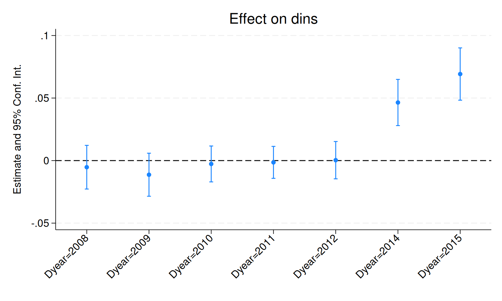
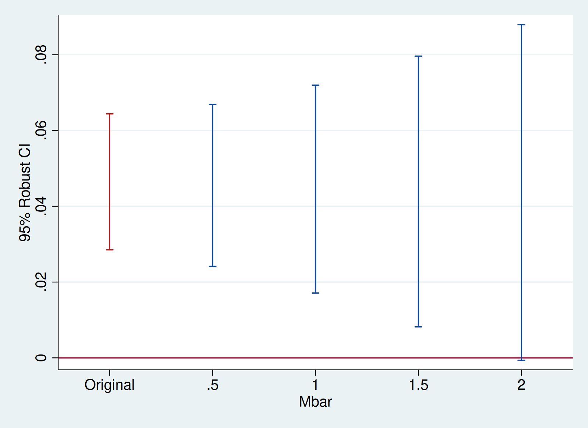

HonestDiD
=========

The HonestDiD package implements the tools for robust inference and
sensitivity analysis for differences-in-differences and event study
designs developed in [Rambachan and Roth (2022)](https://asheshrambachan.github.io/assets/files/hpt-draft.pdf).

`version 0.4.6 15Sep2022` | [Background](#background) | [Installation](#package-installation) | [Examples](#example-usage----medicaid-expansions) | [Acknowledgements](#acknowledgements)

## Background

The robust inference approach in Rambachan and Roth formalizes the
intuition that pre-trends are informative about violations of parallel
trends. They provide a few different ways of formalizing what this
means.

**Bounds on relative magnitudes.** One way of formalizing this idea is
to say that the violations of parallel trends in the post-treatment
period cannot be much bigger than those in the pre-treatment period.
This can be formalized by imposing that the post-treatment violation of
parallel trends is no more than some constant $\bar{M}$ larger than the
maximum violation of parallel trends in the pre-treatment period. The
value of $\bar{M} = 1$, for instance, imposes that the post-treatment
violation of parallel trends is no longer than the worst pre-treatment
violation of parallel trends (between consecutive periods). Likewise,
setting $\bar{M} = 2$ implies that the post-treatment violation of
parallel trends is no more than twice that in the pre-treatment period.

**Smoothness restrictions.** A second way of formalizing this is to say
that the post-treatment violations of parallel trends cannot deviate too
much from a linear extrapolation of the pre-trend. In particular, we can
impose that the slope of the pre-trend can change by no more than *M*
across consecutive periods, as shown in the figure below for an example
with three periods.


Thus, imposing a smoothness restriction with $M = 0$ implies that the
counterfactual difference in trends is exactly linear, whereas larger
values of $M$ allow for more non-linearity.

**Other restrictions**. The Rambachan and Roth framework allows for a
variety of other restrictions on the differences in trends as well. For
example, the smoothness restrictions and relative magnitudes ideas can
be combined to impose that the non-linearity in the post-treatment
period is no more than $\bar{M}$ times larger than that in the
pre-treatment periods. The researcher can also impose monotonicity or
sign restrictions on the differences in trends as well.

**Robust confidence intervals**. Given restrictions of the type
described above, Rambachan and Roth provide methods for creating robust
confidence intervals that are guaranteed to include the true parameter
at least 95% of the time when the imposed restrictions on satisfied.
These confidence intervals account for the fact that there is estimation
error both in the treatment effects estimates and our estimates of the
pre-trends.

**Sensitivity analysis**. The approach described above naturally lends
itself to sensitivity analysis. That is, the researcher can report
confidence intervals under different assumptions about how bad the
post-treatment violation of parallel trends can be (e.g., different
values of $\bar{M}$ or $M$.) They can also report the "breakdown value"
of $\bar{M}$ (or $M$) for a particular conclusion---e.g. the largest
value of $\bar{M}$ for which the effect is still significant.

## Package installation

The package may be installed by using `net install`:

```stata
local github https://raw.githubusercontent.com
net install multe, from(`github'/mcaceresb/stata-honestdid/main) replace
```

## Example usage -- Medicaid expansions

As an illustration of the package, we will examine the effects of
Medicaid expansions on insurance coverage using publicly-available data
derived from the ACS. We first load the data and packages relevant for
the analysis.

```stata
* Install here coefplot, ftools, reghdfe, plot scheme
local github https://raw.githubusercontent.com
ssc install coefplot,      replace
ssc install ftools,        replace
ssc install reghdfe,       replace
net install scheme-modern, replace from(`github'/mdroste/stata-scheme-modern/master)
set scheme modern

* Load data
local mixtape https://raw.githubusercontent.com/Mixtape-Sessions
use `mixtape'/Advanced-DID/main/Exercises/Data/ehec_data.dta, clear
l in 1/5
```

```
     +--------------------------------------------+
     |  stfips   year       dins   yexp2        W |
     |--------------------------------------------|
  1. | alabama   2008   .6814122       .   613156 |
  2. | alabama   2009   .6580621       .   613156 |
  3. | alabama   2010   .6313651       .   613156 |
  4. | alabama   2011   .6563886       .   613156 |
  5. | alabama   2012   .6708115       .   613156 |
     +--------------------------------------------+
```

The data is a state-level panel with information on health insurance
coverage and Medicaid expansion. The variable `dins` shows the share of
low-income childless adults with health insurance in the state. The
variable `yexp2` gives the year that a state expanded Medicaid coverage
under the Affordable Care Act, and is missing if the state never
expanded.

### Estimate the baseline DiD

For simplicity, we will first focus on assessing sensitivity to
violations of parallel trends in a non-staggered DiD (see below
regarding methods for staggered timing). We therefore restrict the
sample to the years 2015 and earlier, and drop the small number of
states who are first treated in 2015. We are now left with a panel
dataset where some units are first treated in 2014 and the remaining
units are not treated during the sample period. We can then estimate the
effects of Medicaid expansion using a canonical two-way fixed effects
event-study specification,

$$
Y_{it} = \alpha_i + \lambda_t + \sum_{s \ne 2013} 1[s = t] \times D_i \times \beta_s + u_{it}
$$

where $D$ is 1 if a unit is first treated in 2014 and 0 otherwise.


```stata
* Keep years before 2016. Drop the 2016 cohort
keep if (year < 2016) & (missing(yexp2) | (yexp2 != 2015))

* Create a treatment dummy
gen byte D = (yexp2 == 2014)
gen `:type year' Dyear = cond(D, year, 2013)

* Run the TWFE spec
reghdfe dins b2013.Dyear, absorb(stfips year) cluster(stfips) noconstant

local plotopts ytitle("Estimate and 95% Conf. Int.") title("Effect on dins")
coefplot, vertical yline(0) ciopts(recast(rcap)) xlabel(,angle(45)) `plotopts'
```

<!-- -->


## Sensitivity analysis using relative magnitudes restrictions

We are now ready to apply the HonestDiD package to do sensitivity
analysis. Suppose we’re interested in assessing the sensitivity of
the estimate for 2014, the first year after treatment. The `reference`
option specifies the index before treatment. In this case there are 5
pre-treatment periods and 2 post-treatment periods.

```stata
* pre  - num. of pre-treatment coefs
* post - num. of post-treatment coefs
* mbar - values of Mbar
honestdid, reference(5) mvec(0.5(0.5)2) omit
```

```
|    M    |   lb   |   ub   |
| ------- | ------ | ------ |
|       . |  0.029 |  0.064 | (Original)
|  0.5000 |  0.024 |  0.067 |
|  1.0000 |  0.017 |  0.072 |
|  1.5000 |  0.008 |  0.080 |
|  2.0000 | -0.001 |  0.088 |
(method = C-LF, Delta = DeltaRM, alpha = 0.050)
```

Note the `omit` option specifies `honestdid` should ignore omitted
regressors (in this case `2013` is included in the output but omitted
from the regression). This can be specially useful if there are
many omitted variables. For example,

```stata
reghdfe dins b2013.year##D, absorb(stfips year) cluster(stfips) noconstant
honestdid, reference(5) mvec(0.5(0.5)2) omit
```

gives the same result. Finally, it is possible to specify the pre and
post period indices manually or pass a custom vector:

```stata
reghdfe dins b2013.Dyear, absorb(stfips year) cluster(stfips)
honestdid, pre(1/5) post(7/8) mvec(0.5(0.5)2)

matrix b = e(b)
matrix V = e(V)
honestdid, b(b) vcov(V) pre(1/5) post(7/8) mvec(0.5(0.5)2)
```

In all cases, the output of the `honestdid` command shows a robust
confidence interval for different values of $\bar{M}$. We see that the
"breakdown value" for a significant effect is $\bar{M} \approx 2$,
meaning that the significant result is robust to allowing for violations
of parallel trends up to twice as big as the max violation in the
pre-treatment period.

We can also visualize the sensitivity analysis using the `coefplot`
option. We can pass the option at the time of the CI computation or we
can use the last results from `honestdid` (which are cached in memory).

```stata
honestdid, coefplot cached
```

Additional options are passed to `coefplot`

```stata
local plotopts xtitle(Mbar) ytitle(95% Robust CI)
honestdid, cached coefplot `plotopts'
```

<!-- -->


## Sensitivity Analysis Using Smoothness Restrictions

We can also do a sensitivity analysis based on smoothness
restrictions---i.e. imposing that the slope of the difference in trends
changes by no more than $M$ between periods.

```stata
honestdid, pre(1/5) post(6/7) mvec(0(0.01)0.05) delta(sd) omit coefplot `plotopts'
```

<!-- -->


We see that the breakdown value for a significant effect is $\bar{M} \approx 0.03$,
meaning that we can reject a null effect unless we are willing to allow
for the linear extrapolation across consecutive periods to be off by
more than 0.03 percentage points.

## Sensitivity Analysis for Average Effects or Other Periods

So far we have focused on the effect for the first post-treatment
period, which is the default in HonestDiD. If we are instead interested
in the average over the two post-treatment periods, we can use the
option `l_vec()`. More generally, the package accommodates inference on
any scalar parameter of the form $\theta = l_{vec}'\tau_{post}$, where
$\tau_{post} = (\tau_1,...,\tau_{\bar{T}})'$ is the vector of dynamic
treatment effects. Thus, for example, creating `matrix l_vec = 0 \ 1`
and setting `l_vec(l_vec)` allows us to do inference on the effect for
the second period after treatment.

```stata
matrix l_vec = 0.5 \ 0.5
honestdid, pre(1/5) post(6/7) mvec(0(0.5)2) l_vec(l_vec) omit coefplot `plotopts'
```

<!-- -->


## Staggered timing

So far we have focused on a simple case without staggered
timing.  Fortunately, the HonestDiD approach works well with
recently-introduced methods for DiD under staggered treatment
timing. Below, we show how the package can be used with the
[did package](https://github.com/bcallaway11/did#difference-in-differences-)
implementing Callaway and Sant’Anna. (See, also, the example on the
did package [website](https://github.com/pedrohcgs/CS_RR)). We are
hoping to more formally integrate the did and HonestDiD packages in the
future---stay tuned!

<!-- TODO: xx port this at some point -->

## Additional options and resources

See the [vignette](https://github.com/asheshrambachan/HonestDiD/blob/master/doc/HonestDiD_Example.pdf) for the R package. You can also view a video presentation about this paper [here](https://www.youtube.com/watch?v=6-NkiA2jN7U).

## Acknowledgements

This software package is based upon work supported by the National
Science Foundation Graduate Research Fellowship under Grant DGE1745303
(Rambachan) and Grant DGE1144152 (Roth). We thank Mauricio Cáceres Bravo
for his help in developing the package.
